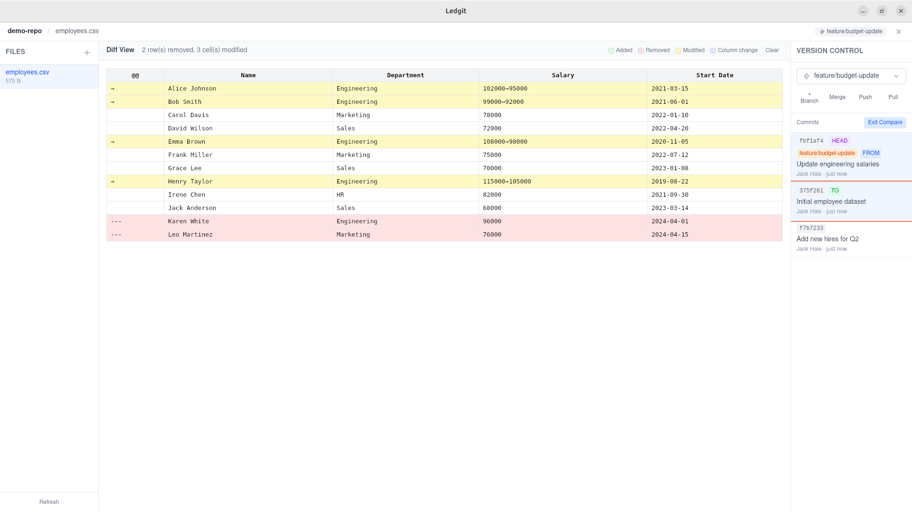

# Ledgit

[](https://github.com/jackhale98/Ledgit/actions/workflows/ci.yml)
[](https://github.com/jackhale98/Ledgit/actions/workflows/build.yml)
[](LICENSE)

A lightweight desktop application for editing CSV files with built-in git version control. Edit your spreadsheets while every change is automatically tracked, enabling full version history, branching, merging, and diffing.

Built with [Tauri 2](https://tauri.app/) (Rust) and [React](https://react.dev/) (TypeScript).



## Download

Pre-built binaries for **macOS**, **Linux**, and **Windows** are available on the [Releases](https://github.com/jackhale98/Ledgit/releases) page.

| Platform | Format |
|----------|--------|
| macOS (Apple Silicon) | `.dmg` |
| Linux | `.deb`, `.AppImage` |
| Windows | `.msi`, `.exe` |

## Features

### Spreadsheet Editing
- Full cell editing powered by [AG Grid](https://www.ag-grid.com/)
- Add, remove, and reorder rows and columns
- Drag-and-drop row reordering via drag handle
- Drag-and-drop column reordering via header
- Right-click context menu: Move Row Up/Down, Move Column Left/Right
- Column sorting and filtering
- Automatic column type inference (number, date, boolean, text)
- CSV and TSV support (auto-detected delimiter)
- Undo/redo with 100-level history
- Auto-save after 2 seconds of inactivity
- Keyboard shortcuts: `Ctrl+S` (save), `Ctrl+Z` (undo), `Ctrl+Y` (redo)

### Version Control
- **Auto-commit** — saves are automatically committed with descriptive messages based on what changed
- **Commit history** — browse paginated commit log with HEAD and branch ref badges
- **Working tree diff** — preview staged changes before committing
- **Branching** — create, switch, and list branches
- **Merging** — fast-forward and three-way merge with conflict detection
- **Conflict resolution** — three-pane editor showing Ours / Merged / Theirs with per-cell accept buttons
- **Diff viewer** — select any two commits to compare with color-coded changes (green = added, red = removed, yellow = modified)
- **Remote operations** — push, pull, add and list remotes

### File Management
- Browse all CSV/TSV files in the repository
- Create and delete files
- File watcher reloads external changes automatically
- Recent repositories list (up to 10)

## Prerequisites

- [Node.js](https://nodejs.org/) (v18+)
- [Rust](https://www.rust-lang.org/tools/install) (stable)
- Tauri system dependencies — see the [Tauri prerequisites guide](https://v2.tauri.app/start/prerequisites/)

## Getting Started

```bash
# Install dependencies
npm install

# Run in development mode
cargo tauri dev
```

The app will open a native window with Vite HMR on `localhost:1420`.

### Demo Repository

A sample repository is included for testing:

```bash
cd examples
./setup.sh
```

This creates `examples/demo-repo/` with employee data across multiple commits and branches. Open it in Ledgit to explore branching, diffing, and merging.

## Building for Production

```bash
cargo tauri build
```

The output binary will be in `src-tauri/target/release/`.

## Commands

```bash
npm run dev           # Start Vite dev server
npm run build         # Build frontend only
npm run lint          # TypeScript type checking
npm test              # Run tests (Vitest)
npm run test:watch    # Run tests in watch mode
cargo tauri dev       # Run full app in dev mode
cargo tauri build     # Build distributable app
```

## Project Structure

```
ledgit/
├── src/                           # React/TypeScript frontend
│   ├── components/
│   │   ├── SpreadsheetEditor/     # AG Grid CSV editor + context menu
│   │   ├── VersionSidebar/        # Branch selector, commit list & panel
│   │   ├── DiffViewer/            # Commit comparison view
│   │   ├── FileExplorer/          # File browser sidebar
│   │   ├── MergeResolver/         # Three-pane conflict resolution
│   │   ├── TitleBar/              # Top navigation bar
│   │   ├── WelcomeScreen/         # Repo selection on startup
│   │   └── common/                # Button, Toast, Modal
│   ├── stores/                    # Zustand state management
│   │   ├── useRepoStore.ts        # Repository lifecycle
│   │   ├── useSheetStore.ts       # Spreadsheet data & undo/redo
│   │   ├── useGitStore.ts         # Git operations & history
│   │   └── useDiffStore.ts        # Diff/compare mode
│   ├── hooks/                     # Custom React hooks
│   │   ├── useAutoSave.ts         # Auto-save with commit
│   │   ├── useKeyboardShortcuts.ts
│   │   ├── useFileWatcher.ts      # External file change detection
│   │   └── useDiffHighlighting.ts # Cell styling for diffs
│   ├── ipc/                       # Tauri IPC bridge (file, git, repo)
│   ├── services/                  # Frontend diff/merge logic
│   ├── types/                     # TypeScript interfaces
│   └── utils/                     # Helpers & formatters
├── src-tauri/                     # Rust backend
│   ├── src/
│   │   ├── commands/              # IPC command handlers
│   │   ├── services/
│   │   │   ├── git_service.rs     # Git operations via libgit2
│   │   │   └── file_service.rs    # CSV read/write & type inference
│   │   └── models/                # Shared data types & errors
│   ├── Cargo.toml
│   └── tauri.conf.json
├── examples/                      # Demo repo setup script
├── .github/workflows/             # CI + release builds
├── package.json
├── vite.config.ts
└── tsconfig.json
```

## Tech Stack

| Layer | Technology | Purpose |
|-------|-----------|---------|
| Desktop framework | Tauri 2 | Native window, IPC, plugins |
| Frontend | React 18, TypeScript 5 | UI components |
| Spreadsheet | AG Grid 34 | Cell editing, sorting, filtering |
| Styling | Tailwind CSS 4 | Utility-first CSS |
| State | Zustand 5 | Lightweight stores |
| CSV parsing | PapaParse (frontend), csv crate (backend) | Read/write CSV |
| Diff/merge | daff | Table-aware diffing |
| Git | libgit2 (via git2 crate) | All git operations |
| File watching | notify crate | Detect external changes |
| Build | Vite 6 | Frontend bundling & HMR |
| CI/CD | GitHub Actions | Lint, test, cross-platform release |

## License

This project is licensed under the [MIT License](LICENSE).
